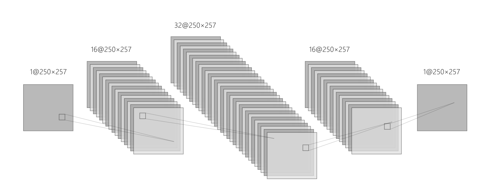
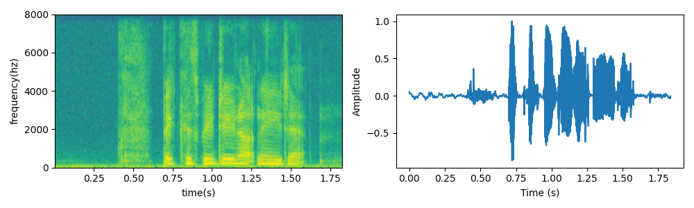
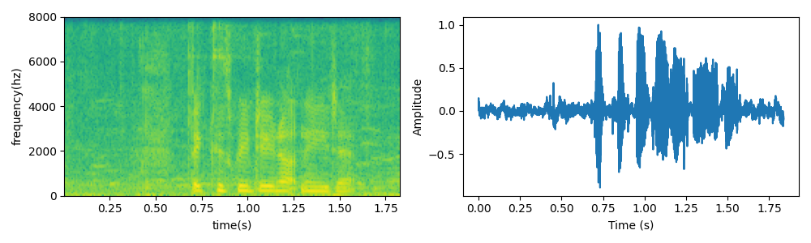
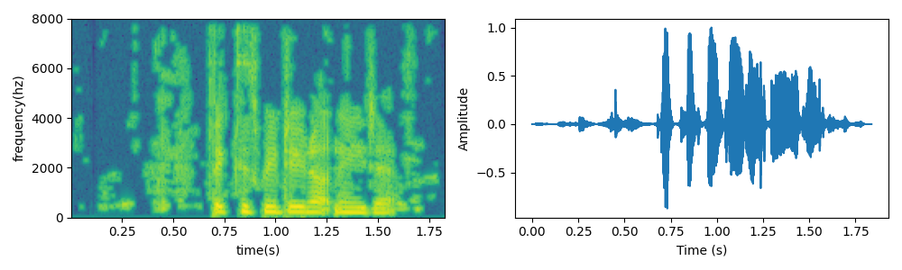
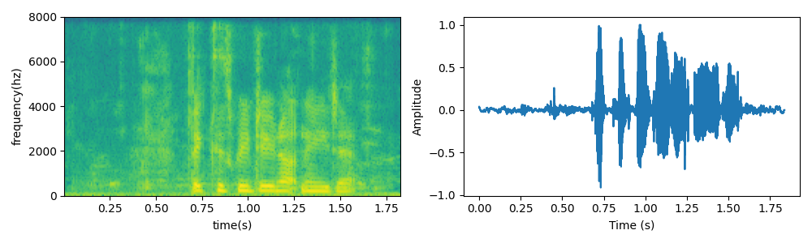
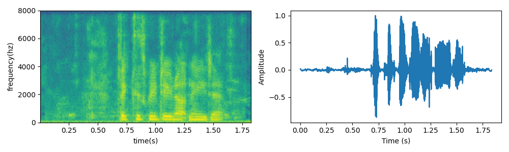
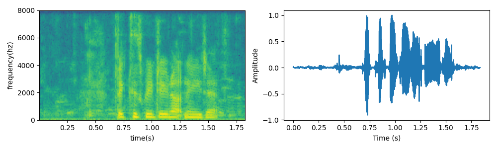

# 不同训练目标下语音增强性能对比

## 网络结构

图中以time_frames = 250为例，输入输出维度是[batch_size=1, channel=1, time_frames, fre_bins=257]

## 结果对比

| 训练目标 | PESQ | STOI(%) |
| :------: | :--: | :-----: |
|  Noisy   | 1.97 |  92.1   |
|   IBM    | 1.98 |  92.1   |
|   IAM    | 2.51 |  92.9   |
|   IRM    | 2.54 |  93.0   |
|   PSM    | 2.58 |  93.3   |
|   ORM    | 2.61 |  93.5   |

## 语谱图及时域波形图
#### 以训练集中的p257_028为例

干净语音：

带噪语音：

ibm：

iam：

irm：

psm：

orm：

